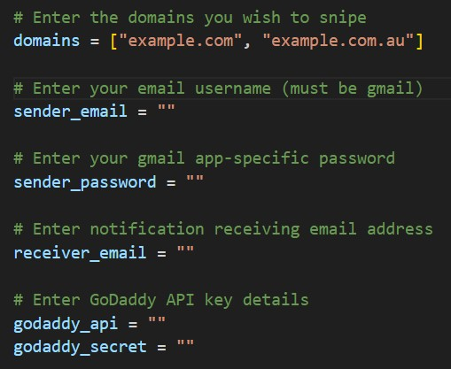

# Domain Sniper - Python Application
This python application checks whether domains are available for purchase using the Wix API and the GoDaddy API. If they are available, it sends an email to notify the user.

 

## Requirements
- Python3: [python.org/downloads](https://www.python.org/downloads/)
- Gmail Account: [mail.google.com](https://mail.google.com/)
- GoDaddy API: [developer.godaddy.com](https://developer.godaddy.com/)

 

## Installation 
Using the python domain sniper requires a Gmail app specific password: [support.google.com](https://support.google.com/accounts/answer/185833)

Input each value into the main.py file:

Execute "python3 main.py" to run the sniper.

 

## Continuous Running
Using [PythonAnywhere](https://pythonanywhere.com/), the script can run 24/7. This is done using the "task" function in PythonAnywhere. 
